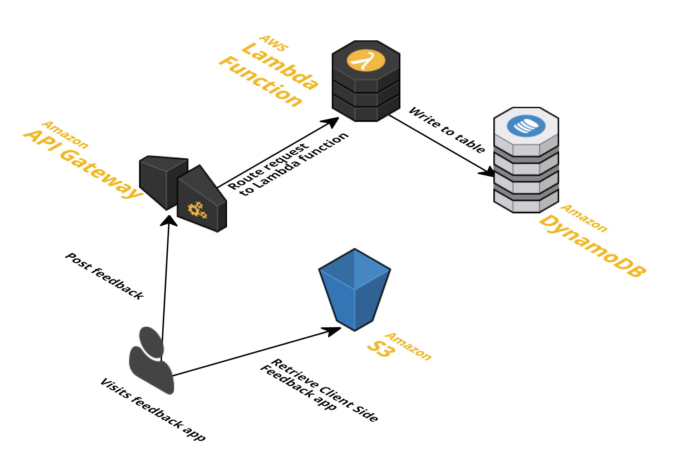

# Feedback app - POC - deprecated

*This project is no longer maintained and was superseded by feedback-app*

Take on feedback app using serverless architecture

- view renders on client side using angular 1.5
- post surveys answers go to aws lambda function


## Client side

Start the app:

    $ cd client
    $ CREATE_ENDPOINT=<api-gateway-url>/survey npm start

Single page app developed using

- [angularjs][angularjs]
- [angular-formly][angular-formly]

Angular formly let us defined the surveys in `json` format. We could even fetch this definition
on render time from remote location.


Additional resources:

- [angular-formly builder][angular-formly builder]

## Server side

Survey app requires only single rest endpoint `POST /survey` in order to persist survey.

Survey is saved in [dynamo-db][dynamo-db] - amazon NOSQL db

### Architecture



### Prerequisites

Create a table in DynamoDB, with a `string` primary key called `surveyid`.

```bash
aws dynamodb create-table --table-name <TABLE_NAME> \
  --attribute-definitions AttributeName=surveyid,AttributeType=S \
  --key-schema AttributeName=surveyid,KeyType=HASH \
  --provisioned-throughput ReadCapacityUnits=1,WriteCapacityUnits=1 \
  --query TableDescription.TableArn --output text
```


### Deployment

Deployment is done using [claudia.js][claudiajs]

Code is based on [dynamo-db example][dynamo-db example]


[angularjs]: https://angularjs.org/
[angular-formly]: http://angular-formly.com/
[angular-formly builder]: https://rawgit.com/MacKentoch/easyFormGenerator/v1.1.0/index_StepWay.html
[claudiajs]: https://claudiajs.com/documentation.html
[dynamo-db]: http://docs.aws.amazon.com/amazondynamodb/latest/developerguide/Introduction.html
[dynamo-db example]: https://github.com/claudiajs/example-projects/tree/master/dynamodb-example
